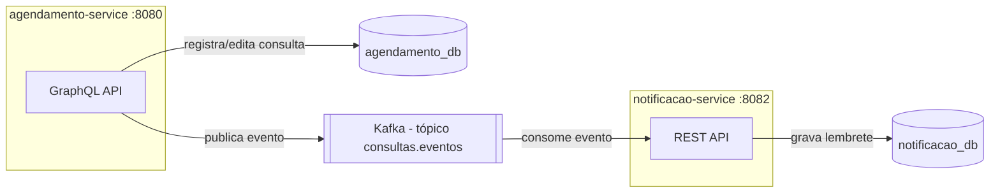

# Tech Challenge - Fase 3 — Sistema de Agendamento Hospitalar

Projeto avaliativo da Fase 3 da pós-graduação em Arquitetura e Desenvolvimento
Java (FIAP). Backend de um sistema hospitalar simplificado, com autenticação
por perfil, consultas via GraphQL e comunicação assíncrona entre serviços via
Kafka.

O enunciado completo está em `.claude/ADJT - BB - Tech Challenge - Fase 3.pdf`.

## Sobre o projeto

O sistema tem três tipos de usuário — **médico**, **enfermeiro** e
**paciente** — cada um com permissões diferentes sobre o agendamento e o
histórico de consultas. Quando uma consulta é criada ou editada, um lembrete
é enviado automaticamente ao paciente através de um serviço separado, que
reage a um evento publicado no Kafka (não é chamada direta entre os
serviços).

## Arquitetura



- **agendamento-service**: dono do cadastro de usuários e das consultas.
  Expõe uma API GraphQL protegida por Basic Auth + perfil (Spring Security).
  Toda vez que uma consulta é criada ou editada, publica um evento no tópico
  Kafka `consultas.eventos`.
- **notificacao-service**: escuta o tópico `consultas.eventos` e, quando a
  consulta não está cancelada, grava um lembrete para o paciente. Também
  expõe um endpoint REST simples para consultar os lembretes já enviados.
- Cada serviço tem seu próprio banco Postgres (`agendamento_db` e
  `notificacao_db`) — não há acesso direto de um serviço ao banco do outro,
  só comunicação via Kafka.

## Como rodar

### Pré-requisitos

- Java 21
- Docker e Docker Compose (para o Postgres e o Kafka)

Os dois serviços já vêm com o Maven Wrapper (`./mvnw`), não precisa ter o
Maven instalado.

### 1. Subir a infraestrutura

Na raiz do repositório:

```bash
docker compose up -d
```

Isso sobe:
- Postgres na porta `5432` (usuário/senha `postgres`/`postgres`), já criando
  os bancos `agendamento_db` e `notificacao_db` (via `init-db.sql`).
- Kafka na porta `9092`.

### 2. Rodar o agendamento-service

```bash
cd agendamento-service
./mvnw spring-boot:run
```

Sobe em `http://localhost:8080`. Na primeira execução, o
`UsuarioSeeder` cria automaticamente três usuários de teste (veja a tabela
abaixo).

### 3. Rodar o notificacao-service

Em outro terminal:

```bash
cd notificacao-service
./mvnw spring-boot:run
```

Sobe em `http://localhost:8082` e já começa a escutar o tópico Kafka.

## Usuários pré-cadastrados (seed)

Criados automaticamente pelo `agendamento-service` na primeira execução
(senha igual para todos, só pra facilitar o teste):

| username     | senha    | perfil     |
|--------------|----------|------------|
| `medico`     | `123456` | MEDICO     |
| `enfermeiro` | `123456` | ENFERMEIRO |
| `paciente`   | `123456` | PACIENTE   |

O `notificacao-service` não tem usuários próprios (só reage a eventos do
Kafka). O único endpoint REST dele exige Basic Auth com um usuário técnico
fixo:

| username          | senha    |
|-------------------|----------|
| `equipe-hospital`  | `123456` |

## Permissões por perfil

| Ação                                 | Médico | Enfermeiro | Paciente |
|---------------------------------------|:------:|:----------:|:--------:|
| Registrar consulta                    |   ✅   |     ✅     |    ❌    |
| Editar consulta                       |   ✅   |     ✅     |    ❌    |
| Ver histórico de qualquer paciente    |   ✅   |     ✅     |    ❌    |
| Ver o próprio histórico (paciente)    |   —    |     —      |    ✅    |

## Endpoints da API

### agendamento-service — GraphQL (`http://localhost:8080/graphql`)

Todas as requisições exigem Basic Auth. Há uma interface interativa em
`http://localhost:8080/graphiql` pra explorar o schema sem precisar montar
o JSON na mão.

**Queries**

```graphql
# Lista todo o histórico de um paciente
query {
  historicoDoPaciente(pacienteId: 3) {
    id status dataHora observacoes
    medico { username }
  }
}

# Lista só as consultas futuras
query {
  consultasFuturas(pacienteId: 3) {
    id status dataHora
  }
}
```

Um paciente só consegue consultar o próprio `pacienteId` — tentar consultar
o de outro paciente retorna erro `FORBIDDEN`.

**Mutations** (médico ou enfermeiro)

```graphql
mutation {
  registrarConsulta(
    pacienteId: 3
    medicoId: 1
    dataHora: "2026-12-01T10:00:00"
    observacoes: "Consulta de rotina"
  ) {
    id status
  }
}

mutation {
  editarConsulta(id: 1, status: REALIZADA, observacoes: "Paciente compareceu") {
    id status observacoes
  }
}
```

### notificacao-service — REST (`http://localhost:8082`)

| Método | Rota                | Descrição                                    | Auth |
|--------|----------------------|-----------------------------------------------|------|
| GET    | `/api/notificacoes` | Lista os lembretes já enviados aos pacientes  | Basic Auth |

Os lembretes são criados automaticamente pelo consumidor Kafka — não existe
endpoint para disparar um lembrete manualmente.

## Testando com Postman

A collection está em `postman/tech-challenge-fase3.postman_collection.json`.
Ela já vem com os dois serviços, as variáveis de URL e os usuários de teste
configurados — basta importar no Postman (ou Insomnia) e rodar. Mais
detalhes no `postman/README.md`.

## Tecnologias

- Java 21 + Spring Boot 4.1.1
- Spring Security (Basic Auth + `@PreAuthorize` por perfil)
- Spring for GraphQL
- Spring Kafka
- Spring Data JPA + PostgreSQL
- Maven
